# Multi-Tier Web Application Stack Setup on Laptop/Desktop

## Prerequisite

To complete this project you should have your lab set-up with the appropriate tools.

Git Bash or any Code editor of choice
Oracle VirtualBox
Install Vagrant, and Vagrant Plugins.
Firstly We Set-up our VMs
Clone the project repository to your local environment (using gitbash) 
## VM SETUP
1. Clone source code.
~~~
https://github.com/proBaxia/vprofile-project
~~~
2. Switch to the local-setup branch.
3. cd into vagrant/Manual_provisioning.

Bring up vm’s
~~~
 vagrant up
~~~ 
You might need to install vagrant plugins host-manger , run below command if you encounter errors while your VMs are coming up and run the Vagrant up command again
~~~
vagrant plugin install vagrant-hostmanager
~~~
~~~
 vagrant up
~~~ 
It is important to note that bringing up the VMs will take sometime depending on your internet speed. If setup process stops, run vagrant up command again until all 5 VMs are up and running.

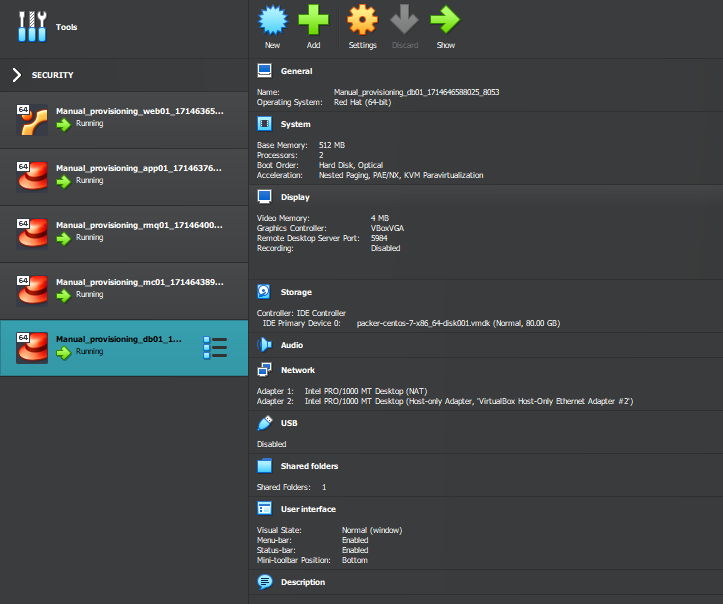

With all the VM’s now setup, lets validate via ssh into the VM’s starting with the web server named web01. Run command..
~~~
vagrant ssh web01
~~~

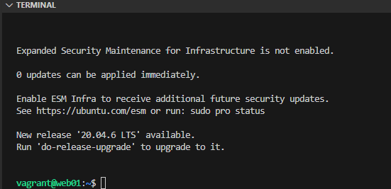

We are now inside the web server. Next, let us Check the host to validate all were automatically updated by running the cat command to view the content in in the /etc/hosts file
~~~
cat /etc/hosts
~~~

Great, now ping the app server to confirm connectivity and communication
~~~
ping app01
~~~
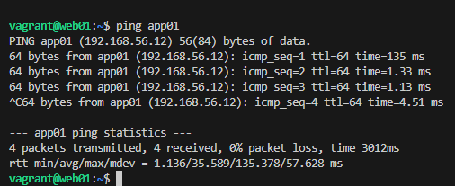

Connectivity was successful, logout of the web01 server and connect to the app01 server and check connectivity to the database VM db01, the memcache VM mc01 and the rabbitMQ VM respectively rmq01 since the application server will be communication directly with all 3 servers (VMs)
~~~
logout
~~~

~~~
vagrant ssh app01
~~~
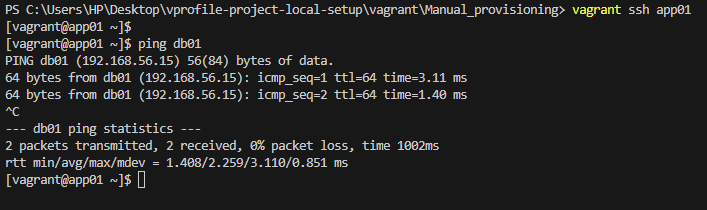

app01 connects to db01 successfully i.e we have connectivity between the application server and the database server

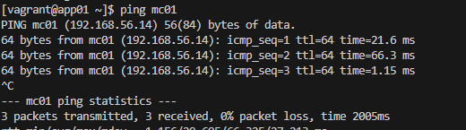

same for app server and Memcache server mc01 and finally checking connectivity between app01 and queuing agent RabbitMQ server rmq01 was also successful.

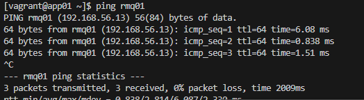

# Provisioning the VMs
The next stage will be to provision the servers manually and there are 6 different services that I will be provisioning in project architecture.

Services
1. Nginx: Web Service
2. Tomcat: Application Server
3. RabbitMQ; Broker/Queuing Agent
4. Memcache; DB Caching
5. ElasticSearch; Indexing/Search service
6. MySQL; SQL Database

# Project Architecture diagram 
**i will use licid to create the Project Architecture diagram latter**

The Setup for the service will be done in below order staring from setting up the Database service down to the Web service accordingly.
1. MySQL (Database SVC)
2. Memcache (DB Caching SVC)
3. RabbitMQ (Broker/Queue SVC)
4. Tomcat (Application SVC)
5. Nginx (Web SVC)

# Provisioning Database SVC — MySQL setup
ssh into the db01
~~~
vagrant ssh db01
~~~
Switch to root user and update all packages to latest patches when logged into the VM. Also set repository by installing EPEL Extra Packages for Enterprise Linux
~~~
sudo -i
yum update -y
yum install epel-release -y
~~~
Set up db password using DATABASE_PASS environment variable and add it to /etc/profile file by running;
~~~
DATABASE_PASS='admin123'
~~~
To save the variable permanently, add the variable to/etc/profile file and update it using a text editor of choice. I used vim so i install vim using yum install vim command first and then below scripts
~~~
vim /etc/profile

source /etc/profile
~~~

Next is to install Maria DB and git Package
~~~
yum install git mariadb-server -y
~~~
Once Mariadb is installed, start and enable mariadb service. Also ensure to check the status of mariadb service to make sure it’s active (running)
~~~
systemctl start mariadb
systemctl enable mariadb
systemctl status mariadb
~~~

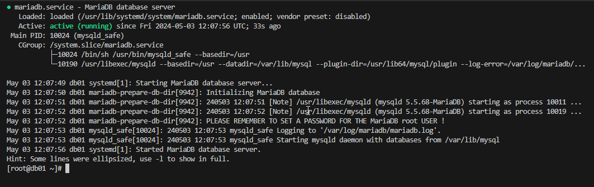

RUN mysql secure installation script.
~~~
mysql_secure_installation
~~~
For db root password, I used admin123

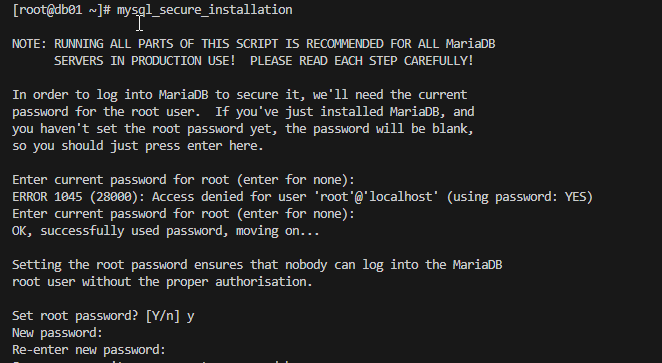
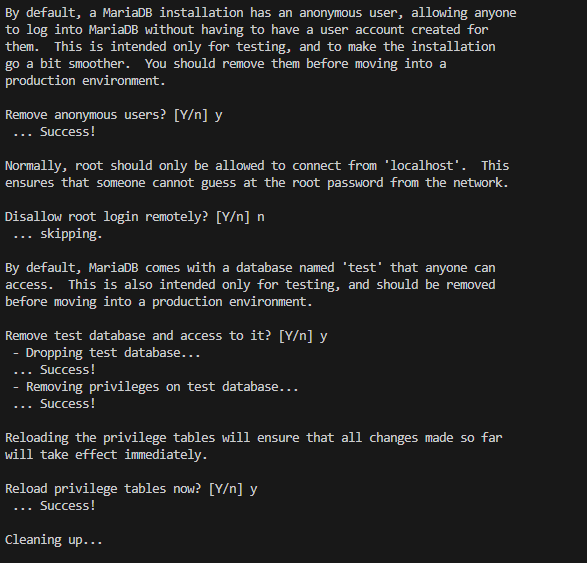

Validate connectivity to db with command below: at the password prompt enter admin123 . If connection is succesful exit from DB.

~~~
mysql -u root -p

exit
~~~
**mysql -u root -p image**
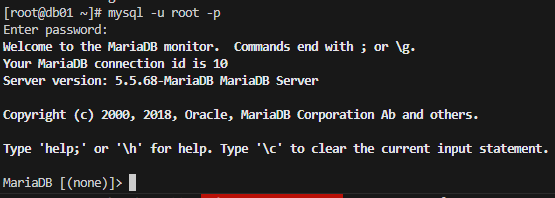

I proceeded to clone source code to db VM, change directory to src/main/resources/ to get the `sql queries.

~~~
git clone https://github.com/devopshydclub/vprofile-project.git

cd vprofile-project/src/main/resources/
~~~
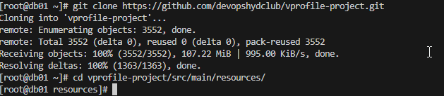

Create a database account, Configure the db and initialize
~~~json
mysql -u root -p"$DATABASE_PASS" -e "create database accounts"

mysql -u root -p"$DATABASE_PASS" -e "grant all privileges on accounts.* TO 'admin'@'app01' identified by 'admin123' "

cd ../../..

mysql -u root -p"$DATABASE_PASS" accounts < src/main/resources/db_backup.sql

mysql -u root -p"$DATABASE_PASS" -e "FLUSH PRIVILEGES"

~~~
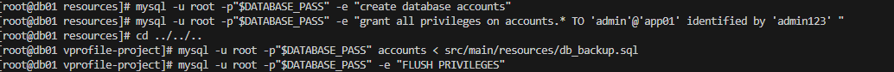

Login to the database and verify
~~~
mysql -u root -p "$DATABASE_PASS"
~~~
**Login to the database and verify** image

Restart Mariadb server and logout, db is provisioned and ready
~~~
systemctl restart mariadb

exit
~~~
# Provisioning (DB Caching SVC) Memcache setup
following the flow of service provisioning highlighted above we will log-in to memcached server, (mc01) and switch to root user with below commands
~~~
vagrant ssh mc01

sudo -i
~~~
Just as MySQL provisioning, update OS with latest patches and download epel repository.
~~~
yum update -y

yum install epel-release -y
~~~
Install memcached package.
~~~
yum install memcached -y
~~~
Start/enable the memcached service and check the status of service.
~~~js
systemctl start memcached
systemctl enable memcached
systemctl status memcached
~~~
**systemctl status memcached** IMAGE
To enable memcached to listen on TCP port 11211 and UDP port 11111 run below command.

~~~
memcached -p 11211 -U 11111 -u memcached -d
~~~
To Validate if the port is running, run command
~~~
ss -tunlp | grep 11211
~~~
**ss -tunlp | grep 11211** image

The Caching server is provisioned and ready, exit from server and continue to the next flow setup.

# Provisioning RabbitMQ
RabbitMQ is used as the queuing agent in the stack for a application. To begin the setup we login into Rabbit MQ server (rmq01) and switch to root user.
~~~
vagrant ssh rmq01

sudo -i
~~~~
Updating OS with latest patches and install epel repository.
~~~
yum update -y
yum install epel-release -y
~~~

To install RabbitMQ, there are dependencies that should be installed first such a wget and erlang-solutions. Run below command to set those up.
~~~
yum install wget -y
cd /tmp/
wget http://packages.erlang-solutions.com/erlang-solutions-2.0-1.noarch.rpm
sudo rpm -Uvh erlang-solutions-2.0-1.noarch.rpm
sudo yum -y install erlang socat
~~~
Next Install RabbitMQ server with command below
~~~
curl -s https://packagecloud.io/install/repositories/rabbitmq/rabbitmq-server/script.rpm.sh | sudo bash
sudo yum install rabbitmq-server -y
~~~

Now start/enable the RabbitMQ service and check the status of service.
~~~
systemctl start rabbitmq-server
systemctl enable rabbitmq-server
systemctl status rabbitmq-server
~~~
**systemctl status rabbitmq-server**image

Set up a config change to Create a test user with password test, Create user_tag for the test user as administrator .

Restart rabbitmq service after config change completion
~~~
cd
echo "[{rabbit, [{loopback_users, []}]}]." > /etc/rabbitmq/rabbitmq.config
rabbitmqctl add_user test test
rabbitmqctl set_user_tags test administrator
systemctl restart rabbitmq-server
~~~

Validate service is active/running after restart
~~~
systemctl status rabbitmq-server
~~~
**systemctl status rabbitmq-server** image

Great!, exit rmq01 server to the next service.

# Tomcat Setup (Application SVC)
With vagrant, log into app01 server , and switch to root user.
~~~
vagrant ssh app01
sudo -i
~~~
As per best practice, Update OS with latest patches and download epel repository.
~~~
yum update -y
yum install epel-release -y
~~~
Install dependencies for Tomcat server. (git, wget, maven, java-1.8.0-openjdk)
~~~
yum install java-1.8.0-openjdk -y
yum install git maven wget -y
~~~
(change directory) cd to /tmp/ directory, and download Tomcat.
~~~json
cd /tmp
wget https://archive.apache.org/dist/tomcat/tomcat-8/v8.5.37/bin/apache-tomcat-8.5.37.tar.
tar xzvf apache-tomcat-8.5.37.tar.gz
~~~

Add tomcat user and copy data to tomcat home directory.

Check the new user tomcat with id tomcat command.
~~~
useradd --home-dir /usr/local/tomcat8 --shell /sbin/nologin tomcat
~~~
Copy your data to /usr/local/tomcat8 directory which is the home-directory for tomcat user.
~~~
cp -r /tmp/apache-tomcat-8.5.37/* /usr/local/tomcat8/
~~~
Observe that root user has ownership of all files under /usr/local/tomcat8/ directory, change it to tomcat user.
~~~
ls -l /usr/local/tomcat8/
chown -R tomcat.tomcat /usr/local/tomcat8
ls -l /usr/local/tomcat8/
~~~

## Setup systemd for tomcat
Create a file with below content. once created, Use systemctl start tomcat to start tomcat and systemctl stop tomcat to stop tomcat service.
~~~json
[Unit] 
Description=Tomcat 
After=network.target
[Service]
User=tomcat
WorkingDirectory=/usr/local/tomcat8 
Environment=JRE_HOME=/usr/lib/jvm/jre 
Environment=JAVA_HOME=/usr/lib/jvm/jre 
Environment=CATALINA_HOME=/usr/local/tomcat8 
Environment=CATALINE_BASE=/usr/local/tomcat8 
ExecStart=/usr/local/tomcat8/bin/catalina.sh run 
ExecStop=/usr/local/tomcat8/bin/shutdown.sh 
SyslogIdentifier=tomcat-%i
[Install] 
WantedBy=multi-user.target
~~~

Any changes made to file under /etc/systemd/system/ directory, we need to run below command to be effective and Enable tomcat service.

The service name tomcat has to be same as given /etc/systemd/system/tomcat.service .
~~~
systemctl daemon-reload
~~~
~~~
systemctl enable tomcat
systemctl start tomcat
systemctl status tomcat
~~~
## Code Build & Deploy to Tomcat(app01) Server
Clone the source code into the /tmp directory, then cd into the vproject-project directory.

~~~
git clone https://github.com/devopshydclub/vprofile-project.git
cd vprofile-project/
~~~
To build the artifact with maven, we need to Update the configuration file that connect the backen services i.e, db, memcaches and the queuing agent rabbitMQ service.

This is done by editing the application.properties file in the /src/main/resources/application.properties file using a text editor of your choice. I sued vim.

~~~
vim src/main/resources/application.propertie
~~~
**In application.properties file**

Ensure the settings are correct. Check DB configuration: we named the db server db01 , and we have admin user with password admin123 setup as credentials.

For memcached service, hostname is mc01 and we validated it is listening on tcp port 11211.

For rabbitMQ, hostname is rmq01 and we have created user test with pwd test.

~~~
#JDBC Configutation for Database Connection
jdbc.driverClassName=com.mysql.jdbc.Driver
jdbc.url=jdbc:mysql://db01:3306/accounts?useUnicode=true&characterEncoding=UTF-8&zeroDateTimeBehavior=convertToNull
jdbc.username=admin
jdbc.password=admin123

#Memcached Configuration For Active and StandBy Host
#For Active Host
memcached.active.host=mc01
memcached.active.port=11211
#For StandBy Host
memcached.standBy.host=127.0.0.2
memcached.standBy.port=11211

#RabbitMq Configuration
rabbitmq.address=rmq01
rabbitmq.port=5672
rabbitmq.username=test
rabbitmq.password=test

#Elasticesearch Configuration
elasticsearch.host =192.168.1.85
elasticsearch.port =9300
elasticsearch.cluster=vprofile
elasticsearch.node=vprofilenode
~~~